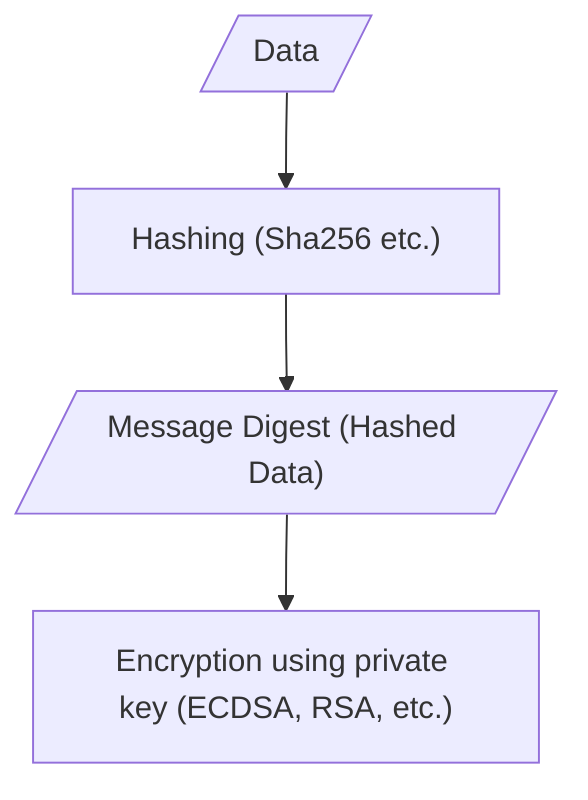
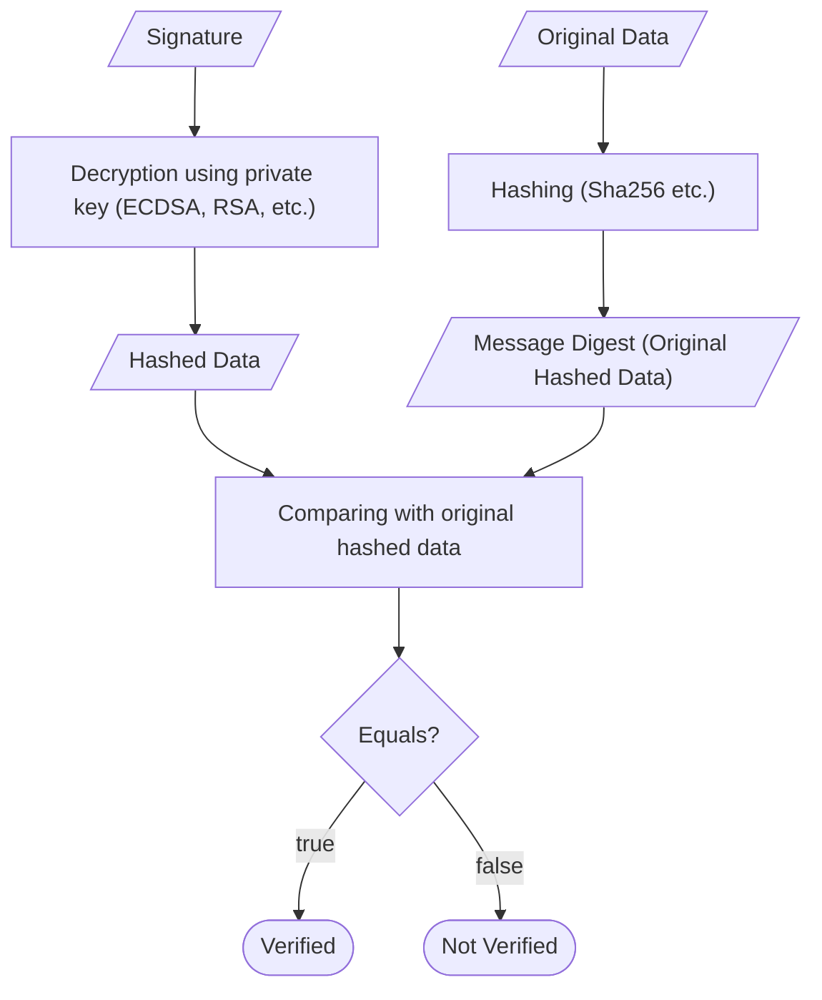
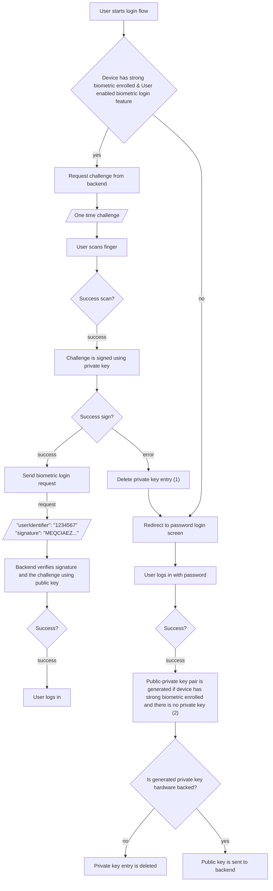

Biometric login provides users with a convenient way to sign in to their accounts. In this article, I’ll explain how to verify a signature for user authorization using a public key to determine whether it was signed by the correct private key, which can only be used if the user authenticates using biometrics.

## Digital signature
Digital signatures allow us to verify that data has not been altered and that it was signed by the legitimate party. These signatures are created using private key which is a part of digital signature algorithm cryptosystems. These algorithms have two processes, signature generation and verification.

Signature generation requires a data to sign and a private key that has to be kept secure and secret by the signer. The verification process requires public key, the signature and the same data so that it can be validated that the signature belongs to the data and it is signed with the private key which is the pair of the public key.

Basically, a signer encrypts a data using private key and a verifier decrypts the signature and compares the output with the original data to check whether they’re equal.

## Signing process
The data that is going to be signed is hashed at first. Then, the hashed output is encrypted using private key.



## Verification process
Received signature is decrypted using public key and the result is compared with hashed original data.



## Algorithms
I used ECDSA in this article but there are other signature algorithms like; DSA, RSA, ECDSA and EdDSA. DSA is not approved anymore.
OWASP [recommends](https://github.com/OWASP/owasp-mastg/blob/master/Document/0x04g-Testing-Cryptography.md#identifying-insecure-andor-deprecated-cryptographic-algorithms) RSA (3072 bits and higher) and ECDSA with NIST P-384 for digital signatures.

## Biometric Login
The biometric login flow I will explain relies on public-key cryptography. Here is how the login flow works basically.



The private key belongs to the user and acts as a secret, similar to a password. It enables signing data securely. When we sign a data using a private key it gives us a signature. This signature is used to determine whether the user who signs the data is really the user of that account. Public key enables verifying the signature using original data.

Before a user can login using biometrics and signing the challenge in background, we have to create a public-private key pair for the user and send the public key to backend **through authorization required endpoint** so that we can be sure that the public key belongs to that user.

The generated key pair [belongs to enrolled biometrics](https://developer.android.com/reference/android/security/keystore/KeyGenParameterSpec.Builder#setInvalidatedByBiometricEnrollment(boolean)) in the Android device. If a new biometric is enrolled after a key pair is generated, the key pair is invalidated [as default](https://developer.android.com/reference/android/security/keystore/KeyGenParameterSpec.Builder#setInvalidatedByBiometricEnrollment(boolean)) to prevent unauthorized access when new biometrics are added. Meanwhile, when the key pair is generated, private key is put in a hardware called [Trusted Execution Environment](https://globalplatform.org/wp-content/uploads/2018/05/Introduction-to-Trusted-Execution-Environment-15May2018.pdf) or [Strong Box Keymaster](https://source.android.com/docs/security/best-practices/hardware#strongbox-keymaster).

1 - *At this point we delete our private key entry because we couldn’t sign the challenge and something is wrong. It probably threw a [KeyException](https://developer.android.com/reference/java/security/KeyException) if we implemented the code correctly. Because user added an additional biometric in device and this invalidated the private key. Key pair generation and signing processes require exception handling which I demonstrated in [my project](https://github.com/mutkuensert/AndroidSignatureExample).*

2 - *Here we always create a key pair for the user. If user enabled the feature and then added an additional biometric(fingerprint), a KeyException will be threw during biometric login and we will have deleted the key. The feature is enabled in this case so we should create a new key pair at this point while user is authenticated using password, therefore the user can do biometric login on next login without problem.*

## Strong biometric
Strong biometric or/and lock screen credentials [can be preferred for keys](https://developer.android.com/privacy-and-security/keystore#UserAuthentication) but we need strong biometric for a secure biometric login. We have to determine whether the user has set up strong biometric before creating key pair in this biometric login flow because **we can’t create a key pair that requires strong biometric authentication when there is no enrolled strong biometric in the device.** As a note; [strong biometric(class 3)](https://source.android.com/docs/security/features/biometric) is only fingerprint for most of the Android devices for now.

## Generating key pair and signing
I created a simple code below for this article similar to the one in [Android documentation](https://developer.android.com/privacy-and-security/keystore) adding some changes assuming the device has strong biometrics enrolled. We will use [elliptic curve](https://en.wikipedia.org/wiki/Elliptic-curve_cryptography) as in the documentation. I’ll explain important parts in comments.

*See [KeyPairManager](https://github.com/mutkuensert/AndroidSignatureExample/blob/master/app/src/main/java/com/mutkuensert/androidsignatureexample/signature/KeyPairManager.kt) for a comprehensive implementation.*

```kotlin
import android.os.Build
import android.security.keystore.KeyGenParameterSpec
import android.security.keystore.KeyInfo
import android.security.keystore.KeyProperties
import android.util.Base64
import android.util.Log
import java.security.KeyFactory
import java.security.KeyPair
import java.security.KeyPairGenerator
import java.security.KeyStore
import java.security.Signature
import java.util.UUID

val dsaAlgorithm = "SHA256withECDSA"
val alias = "biometricLoginPair"
val keyStoreProvider = "AndroidKeyStore"

private val TAG = "Example"

fun createSignature() {
    val challenge = UUID.randomUUID().toString()
    Log.i(TAG, "One time challenge: $challenge")

    val keyPairGenerator = KeyPairGenerator.getInstance(
        KeyProperties.KEY_ALGORITHM_EC,
        keyStoreProvider
    )
    val parameterSpec = KeyGenParameterSpec.Builder(
        alias,
        KeyProperties.PURPOSE_SIGN or KeyProperties.PURPOSE_VERIFY
    ).run {
        /*
        // We restrict it to strong biometric authentiocation so that it can
        // not be used without successful biometric authentication.
        setUserAuthenticationRequired(true)

        if (Build.VERSION.SDK_INT >= 30) {
            setUserAuthenticationParameters(1, KeyProperties.AUTH_BIOMETRIC_STRONG)
        } else {
            @Suppress("DEPRECATION")
            setUserAuthenticationValidityDurationSeconds(1)
        }*/

        setDigests(KeyProperties.DIGEST_SHA256, KeyProperties.DIGEST_SHA512)
        build()
    }

    keyPairGenerator.initialize(parameterSpec)

    val keyPair = keyPairGenerator.generateKeyPair()

    if (!isInsideSecureHardware(keyPair)) {
        return
    }

    val publicKeyBase64: String = Base64.encodeToString(keyPair.public.encoded, Base64.NO_WRAP)
    Log.i(TAG, "Public Key (Base64): $publicKeyBase64")
    //We retrieved the public key, we can send it to backend.

    val keyStore = KeyStore.getInstance("AndroidKeyStore").apply {
        load(null)
    }
    val entry: KeyStore.Entry = keyStore.getEntry(alias, null)
    if (entry !is KeyStore.PrivateKeyEntry) {
        return
    }

    //We sign the challenge using private key
    val signatureBytes: ByteArray = Signature.getInstance(dsaAlgorithm).run {
        initSign(entry.privateKey)
        update(challenge.encodeToByteArray())
        sign()
    }

    val signature: String = Base64.encodeToString(signatureBytes, Base64.NO_WRAP)
    Log.i(TAG, "Signature (Base64): $signature")
    //We signed the data we can request for login.
}

private fun isInsideSecureHardware(keyPair: KeyPair): Boolean {
    val factory = KeyFactory.getInstance(KeyProperties.KEY_ALGORITHM_EC, keyStoreProvider)
    val keyInfo = factory.getKeySpec(keyPair.private, KeyInfo::class.java)
    return keyInfo.isHardwareBacked()
}

private fun KeyInfo.isHardwareBacked(): Boolean {
    return if (Build.VERSION.SDK_INT >= 31) {
        securityLevel == KeyProperties.SECURITY_LEVEL_TRUSTED_ENVIRONMENT
                || securityLevel == KeyProperties.SECURITY_LEVEL_STRONGBOX
    } else {
        @Suppress("DEPRECATION")
        isInsideSecureHardware
    }
}
```
**The line containing isInsideSecureHardware(keyPair) is crucial.** [Trusted Execution Environment](https://globalplatform.org/wp-content/uploads/2018/05/Introduction-to-Trusted-Execution-Environment-15May2018.pdf) and [Strong Box Keymaster](https://source.android.com/docs/security/best-practices/hardware#strongbox-keymaster) provide secure storage for private keys. If you run this code on an emulator, the early return in the if block will be executed since emulators do not support TEE or StrongBox. If you need to test key pair generation on an emulator, you can comment out that section. However, in a production environment, **a private key that is not stored inside secure hardware must not be used** for security reasons.

To keep this article focused on the core implementation, I have not enabled StrongBox in the provided code.

When configuring **KeyGenParameterSpec.Builder** there is a commented out restriction code for restricting private key access to biometric authentication. Normally, if you copy-past the code above as it is and run it, you will see public key and signature are printed in logcat. If you apply the commented out code and run it, you’ll get **UserNotAuthenticatedException**.

When we use biometric authentication restriction for key generation, we have to prompt biometric authentication and get user authenticated through system prompt before signing a data. When we do this, the system detects successful biometric authentication and we can sign a data using private key during limited time we specified in the commented out restriction code. See [setUserAuthenticationValidityDurationSeconds](https://developer.android.com/reference/android/security/keystore/KeyGenParameterSpec.Builder#setUserAuthenticationValidityDurationSeconds(int)) and [setUserAuthenticationParameters](https://developer.android.com/reference/android/security/keystore/KeyGenParameterSpec.Builder#setUserAuthenticationParameters(int,%20int)).

Verifying in backend
```json
{
  "userIdentifier": "12345",
  "signature": "MGYCMQDM/A55vkazrGtFjEYqlntOYfuRRdwcqEcwv+HEQ+85mRk8Qbd+81raWC7m0f3ipfcCMQCP81gQcZP4KHU1bMbF0D7zEkhlkzNh3EV5HlFLLiINhjY3XhtgbwIzDo3DU1awdRI="
}
```

When we receive a request like the one above to our backend, we can verify the signature and the challenge(data) using the public key belongs to the user in our database using first verifyData method in the code below.

```kotlin
fun verifyData(publicKey: String, data: String, signature: String): Boolean {
    val pubKey: PublicKey = getPublicKeyFromString(publicKey) ?: return false
    val valid: Boolean = verifyData(pubKey, data, signature)
    return valid
}

fun verifyData(publicKey: PublicKey, data: String, signature: String): Boolean {
    val valid: Boolean = Signature.getInstance("SHA256withECDSA").run {
        initVerify(publicKey)
        update(data.toByteArray())
        verify(Base64.decode(signature, Base64.DEFAULT))
    }
    Timber.i("Signature $signature is valid: $valid")
    return valid
}

fun getPublicKeyFromString(publicKey: String): PublicKey? {
    val publicKeyBytes = try {
        Base64.decode(publicKey, Base64.NO_WRAP)
    } catch (exception: Exception) {
        Timber.e(exception.stackTraceToString())
        return null
    }
    val keySpec = X509EncodedKeySpec(publicKeyBytes)
    val keyFactory = KeyFactory.getInstance(KeyProperties.KEY_ALGORITHM_EC)
    return try {
        keyFactory.generatePublic(keySpec)
    } catch (exception: Exception) {
        Timber.e(exception.stackTraceToString())
        null
    }
}
```
*This code can be converted to Java.*

You can see [my example project](https://github.com/mutkuensert/AndroidSignatureExample) showcases the complete flow of creating key pair in StrongBox with fallback to Trusted Execution Environment, signing a data requiring biometric authentication and verifying it handling exceptions.

<div align="center">
 
</div>

## Notes
This article provides a concise overview of implementing biometric login between an Android client and a backend. It does not cover business-specific details, such as how users will enable the biometric login feature, how they should be informed that all enrolled biometrics on the device will have access to the account, etc. These considerations are left to the reader. The code in this article is a very simple example and is intended for demonstration purposes only. A detailed implementation of key pair management, signing, verification, and the biometric prompt can be found in my example project: [github.com/mutkuensert/AndroidSignatureExample](https://github.com/mutkuensert/AndroidSignatureExample)

For enhanced security, consider implementing [key rotation](https://owasp.org/Top10/A02_2021-Cryptographic_Failures/#:~:text=proper%20key%20management-,or%20rotation%20missing,-?%20Are%20crypto%20keys) as part of your key pair management process.

For Apple devices, refer to [Secure Enclave](https://support.apple.com/guide/security/secure-enclave-sec59b0b31ff/web).

The [KeyGenParameterSpec documentation](https://developer.android.com/reference/android/security/keystore/KeyGenParameterSpec) also provides additional examples.

## Sources
* [Federal Information Processing Standards Publication — Digital Signature Standard](https://nvlpubs.nist.gov/nistpubs/FIPS/NIST.FIPS.186-5.pdf)

* [Owasp Testing Crpyography](https://github.com/OWASP/owasp-mastg/blob/master/Document/0x04g-Testing-Cryptography.md#identifying-insecure-andor-deprecated-cryptographic-algorithms)

* [Java Security Standard Algorithm Names](https://docs.oracle.com/en/java/javase/17/docs/specs/security/standard-names.html#parameterspec-names)

* [Standards for Efficient Cryptography Recommended Elliptic Curve Domain Parameters](https://www.secg.org/sec2-v2.pdf)

* [Android Keystore System](https://developer.android.com/privacy-and-security/keystore)