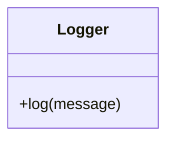
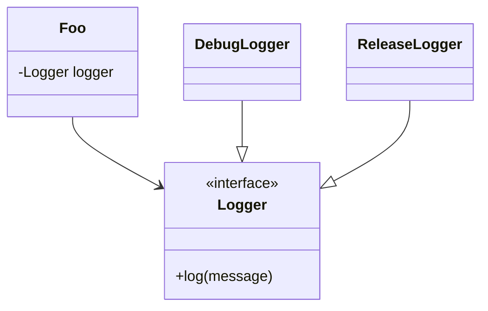
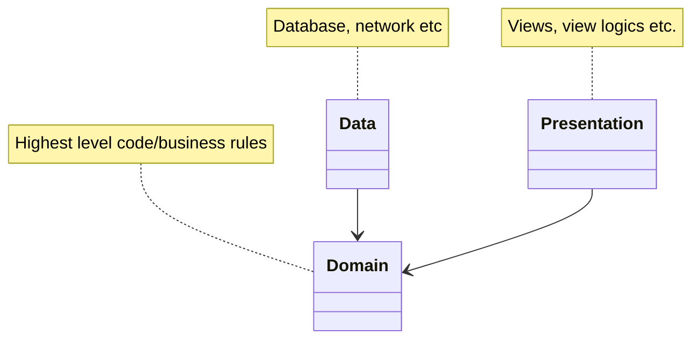
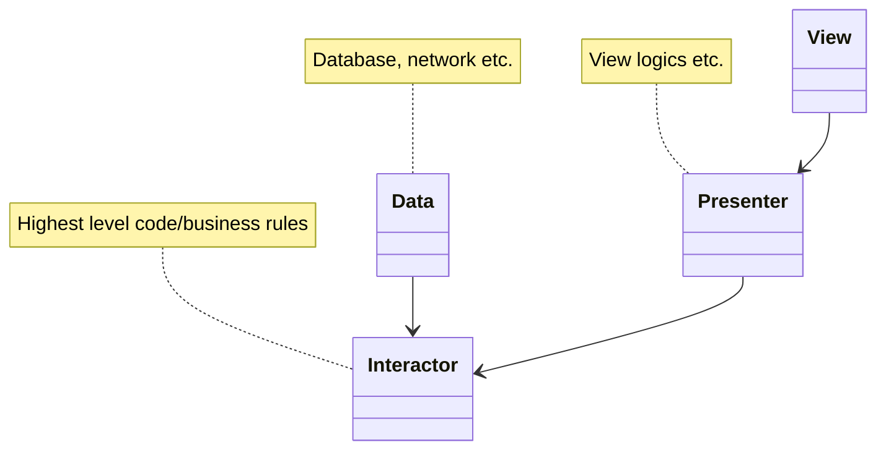
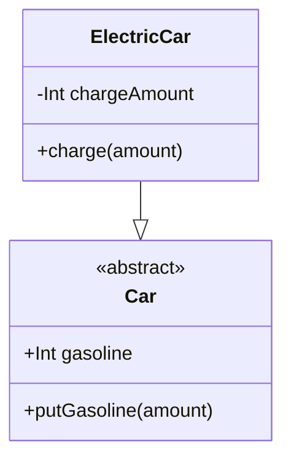
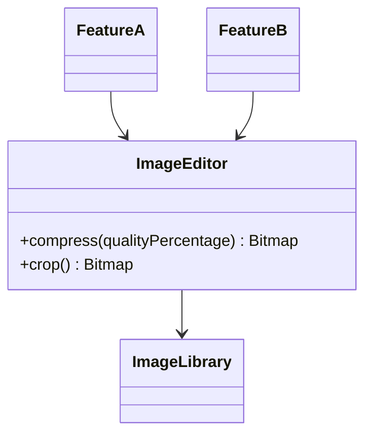
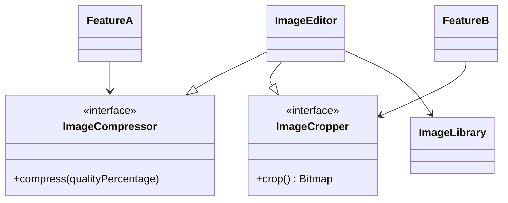
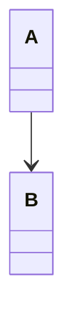
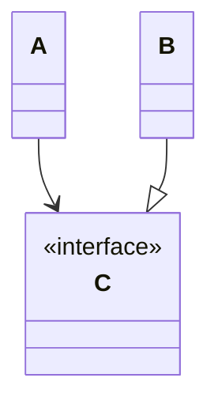

## The Single Responsibility Principle
A module should be responsible to one, and only one, actor, Uncle Bob says.

Suppose we use a class in two different features or screens etc. and the implementation of a method has to be different in these features. A quick fix that violates this principle and may cause big troubles in time is adding a flag parameter in the method and using it in **two different actors**.

Suppose we have a class called **Logger**.

**To see what these diagrams tell [click here](https://mutkuensert.github.io/pages/class-diagrams-with-mermaid.html).**

Let's say if the program is in debug mode we want to print the message, or if the program is in release mode we don't want to print the message but we want to send the message to a service. If we put a flag parameter called **isDebug** in **log** method for example, what will happen if we also want different behavior for different variants like **testDebug, testRelease, productionDebug** etc. The right way to prevent the complexity is:

Class Foo uses Logger interface. This way, we created different implementations(DebugLogger, ReleaseLogger) for different actors(debug mode, release mode).

## The Open-Closed Principle
*"A software artifact should be open for extension but closed for modification."*

or as in the clean architecture book

One of the most important rules is dependency direction must be in one direction only. If class A uses class B, class B cannot know anything about class A.

The purpose of a program, business rules, they are the highest level code should be protected from changes but open for extension so that the changes that are being made in low level code like ui, database etc. won't affect these business rules. As you see in the graphs, other modules depend on domain(or interactor) module. This means that changes in other modules won't affect them.

## The Liskov Substitution Principle

The structure above **forces** the developer to type-check the object to determine if he or she can use the putGasoline method or not. Because if the Car object is an ElectricCar object, using putGasoline method may cause something wrong.

An implementation of a super type must not limit the usage of super type functionalities and must not require type checking so that the the developer can decide to use those functionalities or not.

## The Interface Segregation Principle

Suppose we use an image processing library and created an ImageEditor class using the library. We use this class in more than one place in our program. In new versions of this library, changes in the internals will cause recompiling of the modules that depend on our class. To fix it:

Now, features depend on interfaces only and new changes in the internals of the library won't affect our features and won't cause recompilation.

## The Dependency Inversion Principle
Dependency inversion is a technique that allows us to change dependency direction and actually we used it in previous principles. This principle promotes concrete classes use/depend on interfaces/abstract classes so that changes in implementation details won't affect the ones using them. Suppose we have 2 classes.

class A uses class B. To apply dependency inversion:

This way, B now implements C interface. A uses C and doesn't depend on implementation details(B) anymore.