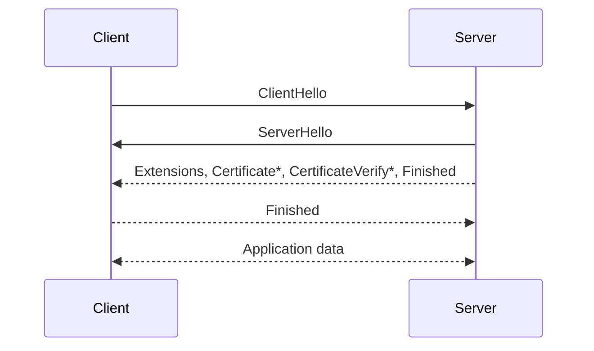

## Cleartext Traffic
Even though the base urls in project configurations usually starts with https, it is better to opt out of cleartext traffic as a precaution. Thus any attempt for a http connection will throw an exception that indicates cleartext traffic is not permitted. Cleartext traffic is [permitted by default](https://developer.android.com/privacy-and-security/security-config#CleartextTraffic) up to Android 8.1 (api 27).

Create a file under xml (network_security_config.xml):

Disable cleartext traffic for all connections
```xml
<?xml version="1.0" encoding="utf-8"?>
<network-security-config>
    <base-config cleartextTrafficPermitted="false" />
</network-security-config>
```

Or enable cleartext for specified domain
```xml
<?xml version="1.0" encoding="utf-8"?>
<network-security-config>
    <base-config cleartextTrafficPermitted="false" />
    <domain-config cleartextTrafficPermitted="true">
        <domain>localhost</domain>
    </domain-config>
</network-security-config>
```

Add it in application in AndroidManifest.xml
```xml
<application
    ...
    ...
    android:networkSecurityConfig="@xml/network_security_config">
```

- https://mas.owasp.org/MASWE/MASVS-NETWORK/MASWE-0050/
- https://mas.owasp.org/MASTG/knowledge/android/MASVS-NETWORK/MASTG-KNOW-0014/

</br>

## Certificate Transparency
To understand the benefit of certificate transparency, we have to understand the certificate's role in TLS handshake. During TLS handshake, server sends **Certificate** and **CertificateVerify** along with the other handshake messages.

TLS 1.3 Handshake steps:


#### Certificate
Certificate message contains leaf and intermediate certificates and client verifies signature in leaf certificate using intermediate certificate's public key. Then client finds issuer root certificate of intermediate certificate in client's trust store and verifies signature in intermediate certificate using root certificate's public key. This verification is called chain of trust and it proves that the leaf certificate is connected to a trusted root certificate in the client’s trust store.

#### CertificateVerify
CertificateVerify is the signature of previous handshake transcript signed with leaf certificate private key. Client verifies this signature using leaf certificate's public key. This proves that the server is the true owner of the certificate and its private key.

#### Transparency
Certificate transparency is a system that requires certificate authorities to submit all certificates to a public log. Thus, domain owners can identify any certificate issued without their approval and request revocation from the certificate authority. That means, if we enforce certificate transparency for our connections in client side, it reduces risk of MITM attacks because domain owners that use certificate transparency can take immediate action for revoking mis-issued certificates.

Certificate transparency doesn’t directly prevent connections with revoked certificates. It's just a public log that contains certificates that are issued for domain names (e.g. domain.com). It makes more sense when it's used along with CRL or OCSP stapling.

We can [enforce certificate transparency](https://developer.android.com/privacy-and-security/security-config#CertificateTransparencySummary) for the certificates in TLS handshakes on Android 16. Unfortunately CT enforcement is not supported on Android 15 (api level 35) and lower. It's disabled on Android 16 (api level 36) by default and enabled on Android 17 (api level 37) by default.

To enable CT enforcement
```xml
<?xml version="1.0" encoding="utf-8"?>
<network-security-config>
    <base-config>
        <certificateTransparency enabled="true" />
    </base-config>
</network-security-config>
```

</br>

## OCSP - Online Certificate Status Protocol
OCSP simply involves asking a certificate's status(good or revoked?) to the certificate authority within a separate network request. But asking something like "Does this certificate belong to this website?" does not coincide with privacy and OCSP responder might have performance or even a connection problem at the moment.

Let's Encrypt [ended OCSP support](https://letsencrypt.org/2024/12/05/ending-ocsp) in 2025. As a result, OCSP-based mechanisms including OCSP stapling are no longer usable for Let's Encrypt certificates anymore. OCSP stapling is a way for servers to include a signed OCSP response in the TLS handshake so that users keep their privacy and potential connection or performance issues while requesting to OCSP responders are prevented. The OCSP response is also signed by certificate authority so that clients can verify it using issuer certificate authority public key(usually intermediate certificate).

It seems that the ecosystem is [shifting](https://www.feistyduck.com/newsletter/issue_121_the_slow_death_of_ocsp) towards short-lived certificates, CRLs or client-managed blocklists.

</br>

## CRL - Certificate Revocation List
Certificate revocation list is a list of digital certificates that have been revoked by the certificate authority. Apple says that they check revoked certificates using CRL for network calls at system level:

*From [support.apple.com](https://support.apple.com/guide/security/tls-security-sec100a75d12/1/web/1), visited on April 20, 2026*
> On devices with iOS 11 or later and macOS 10.13 or later, Apple devices are periodically updated with a current list of revoked and constrained certificates. The list is aggregated from certificate revocation lists (CRLs), which are published by each of the built-in root certificate authorities trusted by Apple, as well as by their subordinate CA issuers. The list may also include other constraints at Apple’s discretion. This information is consulted whenever a network API function is used to make a secure connection.

</br>

Android doesn't directly call it CRL check but they say that they use a combination of a blocklist and certificate transparency

*From [developer.android.com](https://developer.android.com/privacy-and-security/security-ssl#certificate-validation), visited on April 20, 2026*
> To mitigate this risk, Android handles certificate revocation system-wide, through a combination of a blocklist and certificate transparency, without relying on on-line certificate verification. In addition, Android will validate OCSP responses stapled to the TLS handshake.

</br>

## Updating GMS security provider
Android recommends ensuring security provider updates against SSL exploits.

To use ProviderInstaller and others add dependency
```kotlin
implementation("com.google.android.gms:play-services-base:18.10.0")
```
and patch the security provider on [app startup](https://mas.owasp.org/MASTG/best-practices/MASTG-BEST-0020/) as described in [developers.android.com](https://developer.android.com/privacy-and-security/security-gms-provider) before any network connection.

</br>

## Certificate Pinning

Certificate pinning restricts the certificates for client's network configuration to a specified list of public keys so that any other certificate won't be accepted for tls handshakes. The downside of this method is clients have to be updated with the new public key when the certificate is renewed, otherwise connections will be blocked because TLS handshake won't be successful. [While Android doesn't recommend certificate pinning, they say that multiple backup pins should be used to prevent connectivity issues if certificate pinning is used.](https://developer.android.com/privacy-and-security/security-ssl#Pinning)

Other links for certificate pinning
- https://developer.android.com/privacy-and-security/security-config#CertificatePinning
- https://square.github.io/okhttp/3.x/okhttp/okhttp3/CertificatePinner.html

</br>

## References
- https://developer.android.com/privacy-and-security/security-ssl
- https://developer.android.com/privacy-and-security/security-config
- https://developer.android.com/privacy-and-security/certificate-transparency-policy
- https://developer.android.com/privacy-and-security/security-config#CertificateTransparencySummary
- https://auth0.com/blog/the-tls-handshake-explained/
- https://mas.owasp.org/MASWE/MASVS-NETWORK/MASWE-0050/
- https://cheatsheetseries.owasp.org/cheatsheets/HTTP_Strict_Transport_Security_Cheat_Sheet.html
- https://commandlinefanatic.com/cgi-bin/showarticle.cgi?article=art080
- https://mas.owasp.org/MASTG/knowledge/android/MASVS-NETWORK/MASTG-KNOW-0014/
- https://scotthelme.co.uk/revocation-is-broken/
- https://github.com/appmattus/certificatetransparency
- https://letsencrypt.org/2024/12/05/ending-ocsp#must-staple
- https://community.letsencrypt.org/t/whats-the-future-of-ocsp-stapling-is-crl-reintroducing-the-downtime-problem/236707/3
- https://scotthelme.co.uk/designing-a-new-security-header-expect-staple
- https://www.feistyduck.com/newsletter/issue_121_the_slow_death_of_ocsp
- https://www.feistyduck.com/newsletter/issue_123_mozilla_fixes_certificate_revocation_checking
- https://www.ssl.com/sample-valid-revoked-and-expired-ssl-tls-certificates/
- https://knowledge.digicert.com/general-information/ocsp-crl-revoked-ssl-certificates
- https://developer.android.com/privacy-and-security/security-gms-provider
- https://android.googlesource.com/platform/external/conscrypt/+/refs/heads/main/common/src/main/java/org/conscrypt/TrustManagerImpl.java
- https://android.googlesource.com/platform/frameworks/base/+/refs/heads/main/services/core/java/com/android/server/CertBlocklister.java
- https://android.googlesource.com/platform/external/conscrypt/+/refs/heads/main/platform/src/main/java/org/conscrypt/CertBlocklistImpl.java
- https://developer.mozilla.org/en-US/docs/Web/HTTP/Reference/Headers/Strict-Transport-Security
- https://www.imperialviolet.org/2014/04/19/revchecking.html
- https://support.apple.com/guide/security/tls-security-sec100a75d12/1/web/1
- https://www.reddit.com/r/androiddev/comments/w1tk4a/server_tls_certificate_revocationvalidity_check/
- https://mas.owasp.org/MASTG/best-practices/MASTG-BEST-0020/
- https://knowledge.digicert.com/solution/how-certificate-chains-work
- https://www.youtube.com/watch?v=QSeMT4RK62M
- https://www.rfc-editor.org/rfc/rfc8446.html