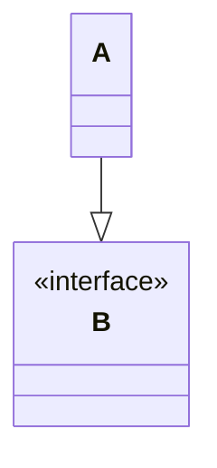
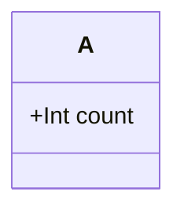
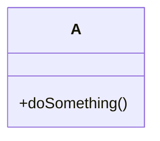
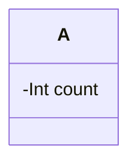
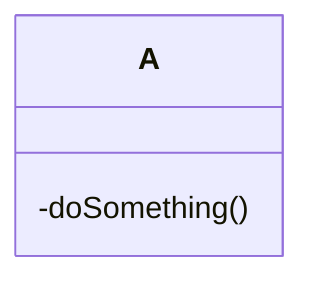

To see more about mermaid js [click here](https://mermaid.js.org/intro/)
#### Class A uses Class B

#### Class A implements interface B

#### Public properties

#### Public methods

#### Private properties

#### Private methods
